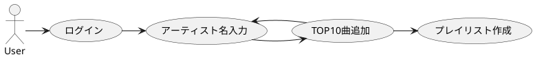

# はじめに

Spotify API と Next.js を使用して、プレイリストを作成するアプリを作成しました。
作成したアプリはこちらになります

https://playlister-x.vercel.app/

# アプリの概要

アプリの一連の流れは以下の図のようになります。（下手な UML 図ですみません...）

お気に入りのアーティストを検索し、そのアーティストの人気曲をプレイリストに追加していきます。この操作を繰り返すことで、複数のアーティストの人気曲をまとめたプレイリストを作成可能です。音楽フェスの予習用プレイリストなどに便利です。

## ログイン

ログイン画面が最初に表示されます。「MAKE YOUR PLAYLIST」ボタンを押すと、Spotify のログイン画面に遷移して、権限の承認を求められます。承認後、メイン画面に遷移します。
Spotify 無料プランのユーザーでも利用可能です。

Spotify API の[Client Credentials Flow](https://developer.spotify.com/documentation/web-api/tutorials/client-credentials-flow)を利用してます。

## アーテイスト名入力

アーテイスト名を入力する際、入力した内容に応じて候補のアーティストが 5 組表示されます。

[Search for Item](https://developer.spotify.com/documentation/web-api/reference/search)API を利用して、入力したアーティスト名に応じた候補を取得します。

## TOP10 曲追加

「人気曲追加」ボタンを押すと、入力したアーティストの人気 TOP10 曲が一覧で表示されます

再び、[Search for Item](https://developer.spotify.com/documentation/web-api/reference/search)API により、アーティスト名に紐づくアーティスト ID を取得します。
そのアーティスト ID を引数にして、[Get Artist's Top Tracks](https://developer.spotify.com/documentation/web-api/reference/get-an-artists-top-tracks)API を利用して人気曲を取得します。

## プレイリスト作成

曲を追加後、プレイリスト名を入力して、「プレイリスト作成」ボタンを押すと、確認ダイアログが表示されます。
このダイアログに対して、「はい」ボタンを押すと、プレイリスト作成処理が走ります。

最後に、[Create Playlist](https://developer.spotify.com/documentation/web-api/reference/create-playlist)API を利用してプレイリスト作成を行います。

:::note alert
Spotify API の都合上、
アプリ作成者本人にしかプレイリスト作成処理を行うことはできないです。
:::

# デプロイ

デプロイは[Vercel](https://vercel.com/)を利用しました。商用目的でなければ、無料プランでもデプロイすることができます。

# さいごに

Spotify API を利用したアプリを作成してみました。今後、さらに機能を追加していく予定です。バグを発見したり、改善案がありましたらこちらの記事でコメントしていただけると助かります。
